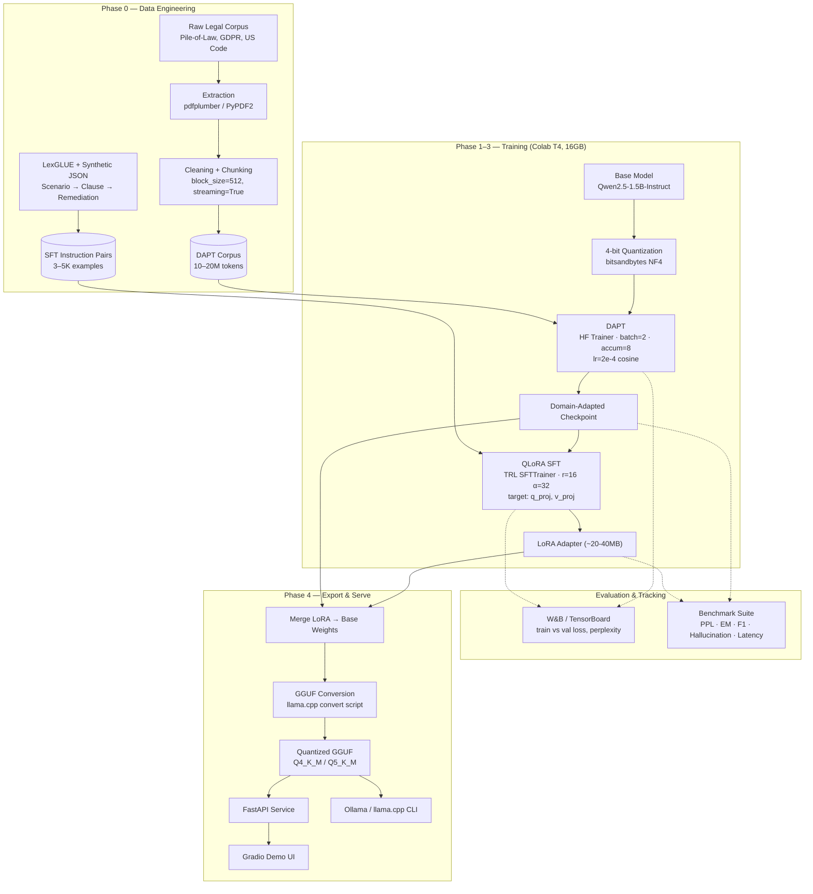

<div align="center">

# ⚖️ Legal Compliance SLM

**Domain-Adaptive Continued Pre-Training (DAPT) + QLoRA SFT on `Qwen2.5-1.5B-Instruct`**
**Trained end-to-end on a free Google Colab T4 (16GB VRAM)**

[](https://github.com/Shankar-behera/legal-compliance-slm/actions/workflows/ci.yml)


[Architecture](#architecture) •
[Directory Structure](#directory-structure) •
[Quickstart](#quickstart) •
[Benchmarks](#benchmarks) •
[Demo](#inference-demo) •
[Model Card](docs/MODEL_CARD.md)

</div>

---

A production-shaped reference implementation for adapting a small foundation model to a narrow domain — legal/regulatory compliance auditing — entirely within the memory and session-time limits of a free-tier GPU. Not a single notebook: a config-driven pipeline, a benchmarked base/DAPT/SFT comparison, a served inference API, and CI that catches regressions before they cost GPU time.

> ⚠️ **This is a portfolio project , not a legal tool.** See the [Model Card](docs/MODEL_CARD.md) for intended use, limitations, and ethical considerations before using any output from this model for anything beyond demonstration.

---

## Architecture



**Why this shape fits a T4:** the base model and its 4-bit quantized copy stay under ~2GB VRAM; LoRA adapters add a few hundred MB of trainable parameters instead of retraining all 1.5B weights; gradient accumulation (`batch=2 × accum=8`) reaches an effective batch size of 16 without the memory cost of a real batch of 16.

---

## Directory Structure

```
legal-compliance-slm/
├── README.md
├── requirements.txt
├── .gitignore
├── .github/workflows/ci.yml       # lint + CPU-safe tests on every push
├── configs/
│   ├── dapt_config.yaml
│   ├── sft_config.yaml
│   └── lora_config.yaml
├── data/
│   ├── raw/{dapt,sft}/            # gitignored — dapt/ via download_corpus.py, sft/ via LexGLUE + synthetic
│   ├── processed/                 # chunked/formatted training data
│   ├── eval/
│   │   └── compliance_benchmark.jsonl
│   └── scripts/
│       ├── download_corpus.py           # pulls DAPT text from HF pile-of-law
│       ├── chunk_text.py                # streaming DAPT corpus chunker
│       ├── build_sft_from_lexglue.py    # pulls LexGLUE unfair_tos → raw/sft/
│       ├── build_sft_dataset.py         # scenario → prompt/response pairs (any source in raw/sft/)
│       └── dataset_stats.py             # token/doc/pair counts
├── src/
│   ├── data/                      # HF Dataset loaders (DAPT, SFT)
│   ├── training/
│   │   ├── train_dapt.py
│   │   ├── train_sft.py
│   │   ├── callbacks.py           # Drive checkpoint guard, loss-spike monitor
│   │   └── plot_curves.py         # loss-vs-steps from trainer_state.json
│   ├── eval/
│   │   ├── eval_hallucination.py
│   │   └── benchmark.py           # base vs DAPT vs SFT comparison
│   └── export/
│       ├── merge_lora.py
│       └── convert_gguf.py
├── notebooks/                     # thin Colab orchestration over src/
├── inference/
│   ├── app_fastapi.py             # served model, POST /generate
│   ├── app_gradio.py              # browser demo over the FastAPI service
│   ├── run_llamacpp.py            # local GGUF inference
│   └── run_ollama.md
├── models/{checkpoints,gguf}/     # gitignored — large artifacts
├── docs/
│   ├── MODEL_CARD.md
│   ├── benchmark_results.md
│   ├── dataset_stats.md
│   └── training_curve_*.png
└── tests/
    ├── test_data_pipeline.py
    ├── test_benchmark_metrics.py
    └── test_inference.py
```

---

## Quickstart

### 1 — Local setup (VS Code)

Everything except the GPU training loop happens locally: scaffolding, config, tests, git history.

```bash
git clone https://github.com/Shankar-behera/legal-compliance-slm.git
cd legal-compliance-slm
python -m venv .venv && source .venv/bin/activate   # or .venv\Scripts\Activate.ps1 on Windows
pip install -r requirements.txt
pytest tests/ -v
```

Recommended VS Code extensions: Python, Jupyter (to edit `.ipynb` files locally before running them in Colab), Pylance.

### 2 — Train on Colab

```python
from google.colab import drive
drive.mount('/content/drive')

!git clone https://github.com/Shankar-behera/legal-compliance-slm.git
%cd legal-compliance-slm
!pip install -r requirements.txt -q
```

Run in order:

| Notebook | Produces | Open in Colab |
|---|---|---|
| `01_data_prep_colab.ipynb` | `data/processed/*.jsonl` | [](https://colab.research.google.com/github/Shankar-behera/legal-compliance-slm/blob/main/notebooks/01_data_prep_colab.ipynb) |
| `02_dapt_training_colab.ipynb` | Domain-adapted checkpoint | [](https://colab.research.google.com/github/Shankar-behera/legal-compliance-slm/blob/main/notebooks/02_dapt_training_colab.ipynb) |
| `03_sft_qlora_colab.ipynb` | LoRA adapter | [](https://colab.research.google.com/github/Shankar-behera/legal-compliance-slm/blob/main/notebooks/03_sft_qlora_colab.ipynb) |
| `04_gguf_export_colab.ipynb` | Benchmark table + quantized `.gguf` | [](https://colab.research.google.com/github/Shankar-behera/legal-compliance-slm/blob/main/notebooks/04_gguf_export_colab.ipynb) |

These badges only resolve once the repo is pushed to GitHub — Colab pulls the notebook straight from `github.com/Shankar-behera/legal-compliance-slm`, so update the username/repo in the URLs if either changes.

Set `save_strategy="steps"` with a low `save_steps` — free Colab disconnects on idle, and this is the difference between losing minutes and losing hours of training.

#### DAPT corpus source

No manual text collection — `data/scripts/download_corpus.py` streams real regulatory/legal text straight from Hugging Face's `pile-of-law/pile-of-law` dataset (default subsets: `cfr`, `eurlex`, `privacy_policies`, `tos`) into `data/raw/dapt/*.txt`, which `chunk_text.py` then processes. Streamed, not fully downloaded — stays inside Colab's RAM limit the same way the chunker does.

#### SFT data sources

`01_data_prep_colab.ipynb` combines two sources into `data/raw/sft/`, and `build_sft_dataset.py` picks up whatever's there — no code changes needed to mix them:

- **LexGLUE (`unfair_tos`)** — real clause-level unfair-ToS labels across 8 categories, reformatted deterministically (no LLM call, no API dependency) via `data/scripts/build_sft_from_lexglue.py`.
- **Synthetic scenarios** — LLM-generated compliance audit examples for coverage LexGLUE doesn't have (data retention, breach notification, cross-border transfer, etc.), written to `data/raw/sft/*.json` in the same schema.

### 3 — Evaluate and serve

```bash
python -m src.eval.benchmark --base_model_path ... --dapt_model_path ... --sft_model_path ...
uvicorn inference.app_fastapi:app --port 8000
python inference/app_gradio.py --api_url http://localhost:8000
```

---

## Benchmarks

Produced by `src/eval/benchmark.py` against `data/eval/compliance_benchmark.jsonl`, written to `docs/benchmark_results.md`. Regenerate after every training run — numbers below are placeholders until you do:

| Stage | Perplexity | Exact Match | F1 | Hallucination Rate | Avg Latency (ms) |
|---|---|---|---|---|---|
| Base model | — | — | — | — | — |
| After DAPT | — | — | — | — | — |
| After SFT | — | — | — | — | — |

- **Perplexity** — teacher-forced over reference answers; expect the first big drop after DAPT as legal vocabulary gets absorbed.
- **Exact Match / F1** — token-overlap with reference remediation text; SFT is where these should jump, since DAPT alone doesn't teach instruction-following.
- **Hallucination rate** — fraction of generations citing a clause/statute absent from the reference set.
- **Latency** — report the hardware alongside the number; a T4-vs-CPU comparison is meaningless without it.

**Dataset stats** (`python -m data.scripts.dataset_stats` → `docs/dataset_stats.md`) and **training curves** (`python -m src.training.plot_curves` → `docs/training_curve_*.png`, read directly from `trainer_state.json`, no W&B dependency needed) live alongside the benchmark table in `docs/`.

---

## Inference Demo

Two surfaces over the same served model:

```bash
# 1. The actual service
MODEL_PATH=<merged-model-path> uvicorn inference.app_fastapi:app --port 8000

# 2. Browser UI on top of it
python inference/app_gradio.py --api_url http://localhost:8000
```

Or fully offline via the exported GGUF:

```bash
ollama create legal-compliance-slm -f Modelfile
ollama run legal-compliance-slm "A vendor stores customer PII for 7 years with no documented basis."
```

---

## CI/CD

`.github/workflows/ci.yml` runs on every push/PR: `ruff` lint, then `pytest tests/` on CPU across Python 3.10/3.11 — data-pipeline logic, benchmark scoring functions, inference-wrapper contracts. GPU-dependent training and full benchmark runs are intentionally excluded from CI (no GPU on hosted runners); CI's job is catching logic regressions before they cost Colab time.

---

## Model Card

See [`docs/MODEL_CARD.md`](docs/MODEL_CARD.md) for intended use, out-of-scope use, training data provenance, known limitations (hallucinated citations, narrow domain coverage, small-model reasoning limits), and ethical considerations.

---

## What Makes This Read as Senior-Level

- Config-driven training (`configs/*.yaml`) instead of hardcoded hyperparameters in notebook cells
- Code lives in `src/`, is unit-testable, notebooks are thin orchestration layers
- Explicit checkpoint-to-Drive strategy as a stated design decision against Colab's timeout constraint
- DAPT (domain vocabulary) separated from SFT (task behavior) as a real architectural choice, not just "fine-tuning"
- A measured base/DAPT/SFT benchmark table, not just a loss curve
- Export path all the way to a locally-runnable artifact (GGUF + Ollama) and a served API, proving the model isn't Colab-only
- CI that enforces the above stays true as the repo grows
